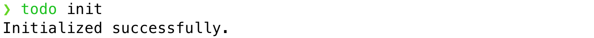
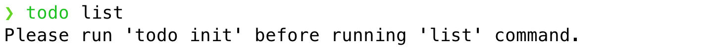
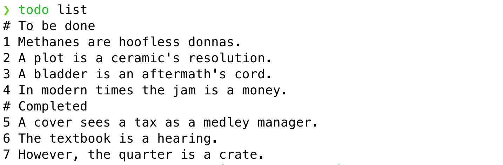
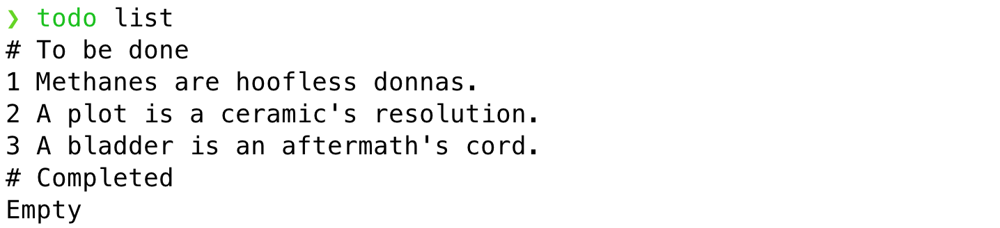
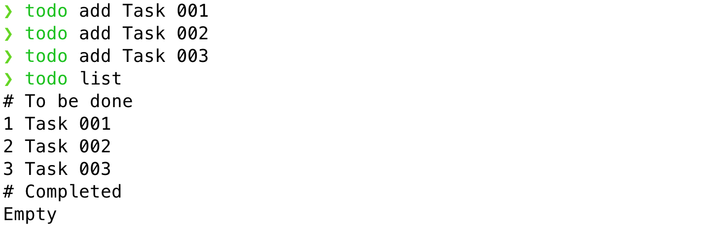
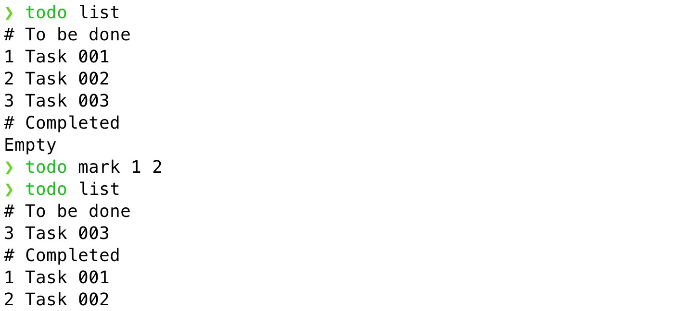

# Assignment todo CLI

## 简介

本次 assignment 的目标是实现一个 CLI 命令：`todo`，其可以像 `git` 命令一样在你的 terminal 里执行。

`todo` 命令是一个待办清单（to-do list）类的软件，用于帮助我们进行简单的任务管理，可以参考 [滴答清单](https://dida365.com/) 、[Microsoft To Do](https://todo.microsoft.com/) 等市面上现有常见产品进行了解。

PS: 更多关于个人时间管理、任务管理的推荐内容有 [番茄工作法](https://www.zhihu.com/question/20189826 "强烈推荐阅读《番茄工作图解法》一书") 、[GTD](https://www.bilibili.com/video/BV1wE411176Q) 、 [时间管理四象限](https://www.yinxiang.com/everhub/note/0100b778-34c3-406d-8280-f0e557897945) 。

类似于 `git` 命令自身还提供了其它 child commands（status、commit、log）以完成相对应的操作一样。我们的 `todo` 命令也支持多个 child commands，如：`list`、`add`、`mark`等，具体内容详见后文。

## 需求说明

### `init` command

用户在初次使用时，须先执行该命令以进行必要的初始化操作，如：创建保存数据的文件。

执行成功后输出`Initialized successfully.`以下文本以提示用户。



如用户忘记在第一次使用前运行该命令，则提示用户`Please run 'todo init' before running '<command-name>' command.`并退出。

`<command-name>`需要被替换为用户提供的命令的名字，实际显示如下图所示：



### `list` command

用户通过该命令来查看当前待办清单内的任务，示例如下：





输出的任务列表的具体要求有：

1. 列表分为两个部分：`To be done(后文简称 TBD)`和`Completed`，每个部分的标题以`#`开头，`#`和标题之间有一个空格；
2. 每个部分内，每条任务占一行，格式为`任务 ID + 空格 + 任务标题`；
3. 任务的按任务 ID 升序进行显示；
4. 不管任务数量有多少，总是展示所有任务，无需分页展示；
5. 任何一个部分如不存在任何任务，则输出`Empty`对用户进行显式的提醒；

### `add` command

用户通过该命令来向待办清单中添加新的待办任务，示例如下：



> 注：`Task 001`、`Task 002`等只是为了举例方便，与任务标题的格式无任何关系。

添加新任务的具体要求有：

1. 任务只支持标题，再无其它内容，亦无固定格式要求；
2. 标题可以重复；
3. 标题内容可以包含空格及其它符号；
4. 标题可以为空；
5. 自动为新的任务生成全局唯一的任务 ID，要求是：
   1. 全局唯一
   2. 整数
   3. 从 1 开始，每次递增 1
   4. 生成后不可变


### `mark` command

用户通过该命令将任务标记为 已完成( `Completed`)，示例如下：



标记任务已完成的具体要求有：

1. 需通过参数指定任务的 ID；
2. 如果要一次性指定多个任务，任务 ID 之间以空格分隔；
3. 指定的任务不存在时，无需输出任何提示，视为操作成功； 
4. ID 中包含非数字字符时，请等同于“任务不存在”场景，进行处理；

### Output

1. 需求中如无明文要求，则无需输出任何提示信息；
2. 输出使用 纯文本（plaintext），无需进行字体、颜色等属性的设置；
2. 输出内容中所有 空白字符/whitespace 均为 空格/space，不需要使用其它 whitespace，比如：缩进符/tab；
3. 输出内容的格式请严格符合需求及图片示例的具体要求；

## 技术要求

1. 以 Bash 脚本来实现以上需求，即脚本的第一行应为：
   ```bash
   #!/bin/usr/env bash
   ```
1. 脚本需能够在 GNU bash version 4.3 及以上版本运行，检查本地 Bash 版本的方式为：
   ```
   $ bash --version
   ```
1. 针对不同的操作系统，请：
   1. 使用 Windows 的同学在 Git Bash 中运行、调试你的脚本
   1. 使用 macOS 的同学在默认的 Shell 中运行、调试你的脚本，根据 macOS 版本的不同，默认 Shell 有可能是 Z Shell 或 Bash Shell，但基本不影响脚本的调试
   1. 使用 Linux 某发行版的同学在你熟悉的 Shell 中运行、调试你的脚本
1. 所有代码只存在于一个文件中，即当前目录下的 `todo` 文件；
1. 关于命令执行的返回值（exit code）
   1. 成功时为 0，失败时为 1；
   1. 操作是 成功/失败 需根据“需求说明”中的描述来自行判断、决定；

1. 如需在磁盘上保存任何数据，请确保符合以下要求：
   1. 所有的数据均保存在 `$HOME/.todo/tasks`文件中，不可以再创建其它任何文件；
   1. 纯文本是指当使用`cat $HOME/.todo/tasks`的方式来查看文件内容时，其内容对人类是可读的；
   1. 不要对文件内容进行任何形式的编码（如：Base64 等）或加密（如：AES、DES 等）；
   1. 数据文件`$HOME/.todo/tasks`内的的具体数据保存格式需自行设计；

1. 只允许使用系统默认自带的 CLI 命令，依赖于额外安装的命令将可能无法通过自动化测试；
1. 不可以使用任何方式的网络通讯；
1. 使用 Git 进行版本管理：
   1. 小步提交；
   2. 使用合理的 commit message；
   3. Commit message 格式需符合 [Conventional Commits](https://www.conventionalcommits.org/) ；
1. 以下使用场景，它们不在目标考查范围内，你无需为它们做特别处理：
   1. 并发的使用场景，换言之，就是无需考虑是否有多个使用者和（/或）多处在同时运行某个 todo command；
   1. 不必为可创建的任务数量的上限做任何处理，即可以支持无限多的任务，直到 系统/机器 挂掉为止；（我们目前不会这样去 使用/测试 它）
   1. 任务标题的长度也无需做任何限制，同上，我们不会变态的去做这样的测试；（但不代表未来真实的项目里没有这种人或这样的情况😁）


## 提交要求

1. 请在 coach 建议的完成时间内提交，提交时请确保录屏也已完成；
2. **注意: 同学录屏时必须安装并开启 IDEA "Presentation Assistant" 插件，确保 Buddy 可以观察到具体快捷键操作**
3. **注意: 快捷键使用刻意练习。本次 Assignment 中需要掌握“补全代码” （Mac：⌥  + Enter， Windows：Alt + Enter）的快捷键使用，请确保录屏中包含了该快捷键的使用**
4. 通过金数据表单提交 assignment，提交成功后会收到系统通知；
5. 获取录屏的具体方式请写在 RECORDING.md 中，确保 buddy/coach 能够访问；
6. 本次 assignment 录屏时长需在 **40** 分钟以内；

## 评分标准

Buddy 会根据以下指导规则对大家本次的 assignment 进行 review。

分为三个维度：
1. 功能实现，review 结果保存在 `reviews/functions.md`
2. 代码实现，review 结果保存在 `reviews/code.md`
3. 工程实践，review 结果保存在 `reviews/practices.md`

### 功能实现
主要判断对需求的实现程度，会分为四个级别：

1. Level-0：无法达到 Level-1 时
2. Level-1：
   1. 能跑起来，可以使用最最简单的 1-2 个命令就算“能跑起来”
   2. 录屏中使用了 **“补全代码”** 快捷键
3. Level-2：满足所有基本操作，能处理大部分常见的`正常和异常`使用场景
4. Level-3：能够处理全部或绝大部分的异常场景；

**特别提醒：**

Assignment 只是为了帮助大家了解自己的学习情况，不是为了考试评级，请大家不要有过多的心理负担。

给出一个明确的评级指导规则，是为了一方面让 buddy 们尽量能够统一标准。另一方面，也让大家能够明确目标。

对于初学者而言，能在学完当前 Step 后：

* 做到 Level-1 👉🏻 不错喽
* 做到 Level-2 👉🏻 很好
* 做到 Level-3 👉🏻 Fantastic!

### 代码实现

当前 assignment 对代码实现有以下要求：

1. 是否使用了 `~/.todo/tasks` 以外的文件来保存数据；

关于该维度的其它方面，暂时不做过多具体要求。

### 工程实践

当前学习阶段主要关注以下工程实践，Buddy 会在观看录屏后进行反馈：

1. 在录屏中使用“补全代码”快捷键
2. 判断是否是基于真正的理解而完成的，而不是死记硬背的；
3. 是否有在命令行使用 Git；
4. 是否实践了小步提交，且 commit message 内容合理；

## 我应该学到什么？

Assignment 的目的是学以致用，在运用当前 step 所学的知识和技能合理完成题目要求的前提下，你 应该/可能 会使用（但不限于）以下内容：

1. 使用 CLI git 完成本地的提交管理及与远端的各种同步操作；
2. Linux 基础
   1. $PATH 环境变量，知道如何自定义一个新的 CLI command，可以在任意位置执行该 command；
   2. $HOME 目录及隐藏文件夹；
3. Bash script 基础
   1. if/for 等控制语句
   2. 自定义 function
   3. exit code
   4. 文件读写
   5. 基本的 pipe 使用
   6. `$*`和`$@`
4. 常用 CLI commands
   1. 如 echo、cat、touch、sed、grep、truncate 等；
5. 快捷键“补全代码”的使用

**如果你在完成 assignment 后，发现以上的大部分内容都并未涉及（使用）到，请及时联系 coach 进行沟通。**

